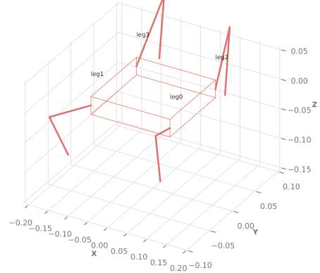
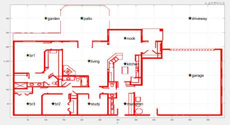
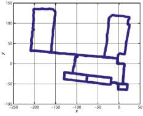
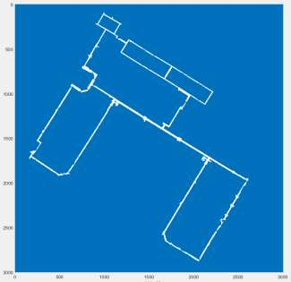

# TEL200_VT26_WalkingRobot

Source PDF: TEL200_VT26_WalkingRobot.pdf

## Page 1

Norges miljø- og biovitenskapelige universitet 
Fakultet for REALTEK  
Institutt for maskinteknikk og teknologiledelse 
TEL200 – Introduction to Robotics  
Walking Robot Project 
Author(s): David A. Anisi, Henrik Nordlie and Ludvik H. Aslaksen 
Figure 1: The walking robot, RVC Chapter 7.4.2

### Images

#### Image 1 (Page 1)

---

## Page 2

Walking Robot Project 
 
The high-level objective of this robot lab is to develop a walking robot able to navigate in an indoor 
environment. It will consist of three parts: 
- a) Motion planning
- b) Path planning
- c) Localization & Mapping.
The objective of part a) and b) will be to develop necessary code and functionality in Python to 
enable the walking robot to move between any two given points in a given map using so called 
“motion primitives” and Probabilistic Road-Map (PRM). In this part of the project, we will use the 
House map (see RVC Chapter 5) as illustrated in Figure 2. 
 
Figure 2: The House map given in Chapter 5. 
Part c) of this project serves as an optional addition (i.e., only necessary for highest grade), where 
navigation based on real robot data and map from the MIT Killian Court is considered. 
This project will hence develop and test your skills based on the combination of knowledge acquired 
during many of the previous parts of the TEL200 course; in particular lectures and Chapters 3-7. 
 
Figure 3: Scan-map from the MIT Killian Court dataset, see Ch. 6.5 
Documentation and reporting 
This project will count and constitute the remaining 40% of the overall course assessment. The 
evaluation will based on the following submitted files:

### Images

#### Image 1 (Page 2)

#### Image 2 (Page 2)

---

## Page 3

1. written report (max 10 pages) 
2. video (maximum 3-minute-long) 
3. all Python files 
All files must be packed into in one single zip file and named "TEL200_Gr_X.zip" where X = your 
group number. Please make only one submission per group. The group leader should normally take 
care of this submission.  
Submission deadline is set to 2026-04-30 
The written report must explain your main ideas as well as implementation details for this project. 
Additionally, you must produce and submit a video (max 3 min) - including commentary audio and/or 
text overlay - showing and explaining your developed solution.  
The following requirements must be followed regarding the submitted report: 
• One report per group. Put the names of all group members on the cover page. 
• The report can be written in English, Norwegian or Swedish   
• Write maximum 10 pages including all possible appendices.  
• You can choose to either use NMBU Report Template for word or LATEX (e.g. using 
Overleaf) to write the report and generate the PDF file. No other report formats will 
be evaluated. 
• The report’s disposition must be based on IMRaD and should contain the following 
sections: 1) Abstract, 2) Introduction, 3) Method, 4) Results, 5) Discussion. See e.g., 
NMBU Structure of a Science Paper and IMRadD and IMROD-strukturen.  
• Include enough details in the report to enable another M.Sc. Robotics student to 
follow your steps and repeat your project.  
• In the report, include as many learning-points and connections as possible with the 
course literature and syllabus. This, to fully manifest what you have learned and 
that you are able to connect your acquired knowledge (theory) and skills (practice). 
This will constitute one of the main evaluation criteria for this project. 
• Before the final deadline, pack the PDF file plus the video and Python files into one 
single ZIP file and submit in accordance with instructions. You may submit your video, 
either as a separate file, or if it’s very large, as a link to an external website where 
you host your video. In the latter case, please make sure that we can access the video 
at any time after your submission.  
• This project is also an exercise in teamwork. Good results are usually achieved by 
groups which organize their work efficiently. You are thus advised to plan your 
project carefully, e.g., using a Gantt chart to highlight the following aspects:  
o How should you distribute the allocated time?  
o Are all team members available during the entire project period?  
o Who is doing what?  
o How often and when will you meet to work on the project?  
o The last week before the deadline (at least 2-3 days) put the focus on the 
report! 
• The top grade for this project will be given to groups which make clear and 
technically sound solutions and simulations, submit a video and produce a well-
structured, well-written and concise report that extensively connects the skills gained 
during this project with the acquired knowledge (theory) in the course syllabus.

---

## Page 4

Part 1: Motion planning 
 
Start with reading Chapter 7.4.2 (A 4-Legged Walking Robot) in RVC. Then test and understand the 
associated Python-file [examples/walkingTEL200.py].  
The Walking Robot defined by [examples/walkingTEL200.py] moves one leg at a time but is 
nevertheless standing still in world-coordinates. To address this, pay particular attention to the 
definition of base coordinate system on the robot body, with origin coinciding with the center point 
of the robot body. Then use a transformation from world to base (denoted  in Eq. (7.3) on page 
267 in RVC) to reposition and draw (i.e., animate) the robot-body in the correct pose at each given 
time. Also, make sure that the ‘limits’ of the environment (on line 93) do not prevent you from 
plotting and seeing the entire robot and its movement. After this, your robot should be able to move 
in world coordinate system as shown in this video (see Canvas [Files>Project Assignments > 
WalkingRobot > WalkingRobot_10cm.mp4]) 
 
The Walking Robot is also only able to move forward; hence cannot re-orient. Our robot model will 
be a modified unicycle model where the overall motion will be decomposed into simple segments of 
either: 
• 
moving a short distance straight forward, or  
• 
standing still and rotating (around the local origin).  
These will constitute the two fundamental motion primitives that can be concatenated in order to 
follow any way-point path originating from graph-based path planning methods (such as PRM). 
To this end, departing from [examples/walkingTEL200.py] Python file – and mimicking the same 
segment concatenation/extraction procedure - construct and save the two motion primitives: 
1. Moving the robot 10 cm forward  
2. Turning the robot 1 degree clock-/anticlockwise.  
Make sure that the robot has at least three supporting legs on the ground at any time-instance - also, 
during the turning motion. For the sake of computation efficiency, the motion primitives must be 
saved and later executed in local joint-space of each leg (ref. qcycle in the current code).  
Test your motion primitives by generating the following motions and report the results: 
1. Move the robot 100 cm straight forward, i.e., from point A = (0, 0, 0) to B = (100, 0, 0)  
2. Turn the robot 10 degrees clock-/anticlockwise, i.e., from A = (0, 0, 0) to C = (0, 0, ±10) 
3. Combine the two aforementioned points to move the robot from point A with straight 
$$
heading (A = (0, 0, 0) ) to point D with heading  = ±10 degrees (D = (100, 0, ±10)).
$$

---

## Page 5

Part 2: Path planning 
 
In order to better match the scale of the robot (order of 0,1m) with the scale of the House map, this 
part of the project will be based on a down-scaled version of the map; where the occupancy grid size 
(i.e., length of each matrix element), is to be perceived as 1 cm and not as ca 4.5 cm per cell as stated 
in the book (see RVC Chapter 5, Fig. 5.5). This implies that the entire House is of size 3,97 x 5,98 m.  
We start by loading a model of a house that is included with the Toolbox, via: 
$$
>>> house = rtb_load_matfile("data/house.mat");
$$
The path-planning functionality will be based on the Probabilistic Road-Map (PRM) planner as 
detailed in Ch. 5.5. The PRM-based path-planner must be able to plan paths between any two 
arbitrary 2D-points in the House map, so please make sure to select ’npoints’, so that you end up 
with a well-connected graph that covers all rooms in the house. 
Test your path planning algorithm by generating the path between at least 5 randomly generated 
start/goal points using the same road-map in the House map and report the results. This can be 
effectively visualized in the video by showing random generation of at least 5 subsequent random 
points and show the robot movement to reach the goal. The same data and generated path can be 
visualized in the report in one single figure. To provide overview, please use a fixed scaling in all the 
plots of the world coordinate in order to encompass the entire house in the figure.   
Nb. The physical size of the robot as well as the choice of local origin may result in parts of 
the robot colliding with the walls. This is expected and accepted in this project. Optionally, 
consult Ch. 5.4.1 for alternatives, e.g., using obstacle inflation to address this issue.  
Part 3: Localization & Mapping 
 
In this last and optional part of the project - i.e., only necessary for highest grade – we consider real 
data collected from MIT Killian Court. The pose-graph based on real lidar data is read using: 
$$
>>> pg = PoseGraph("data/killian.g2o.zip", lidar=True);
$$
Then, extract the scan-map of the pose-graph by  
$$
>> scanMap = pg.scanmap();
$$
Initially, read RVC Ch. 6.8 and study both poseGraph and scanMap code to learn how laser-based 
map building works. In particular, how are the integer numbers in each cell of scanMap being 
calculated and what do they represent? Please include your answer in the report. Hint: See 
implementation of Bresenham algorithm in function scanmap. 
Based on this, modify the scanMap to arrive at a binary occupancy grid called KillianMap, where a 
cell has value 0 - that is considered free and safe - if more than M radar scans have confirmed that. 
While all other cells have value 1, indicating that it may hold an obstacle; wall or unknown. Report 
your line of thought, figures and code to achieve this.  
This modified occupancy map, KillianMap for M = 10 is depicted in Figure 4.

---

## Page 6

Figure 4: The given KillianMap where at least M = 10 radar scans are needed to deem a cell as free.  
Now, set M=10 and generate this modified occupancy map, KillianMap, and use PRM as path-
planner covering the entire free space. Report your line of thought, figures and code to achieve this.  
For this particular map and problem setup, what alternative map-based planning alternatives would 
be more efficient to consider? Report your line of thought, figures and code to achieve this.

### Images

#### Image 1 (Page 6)

---
