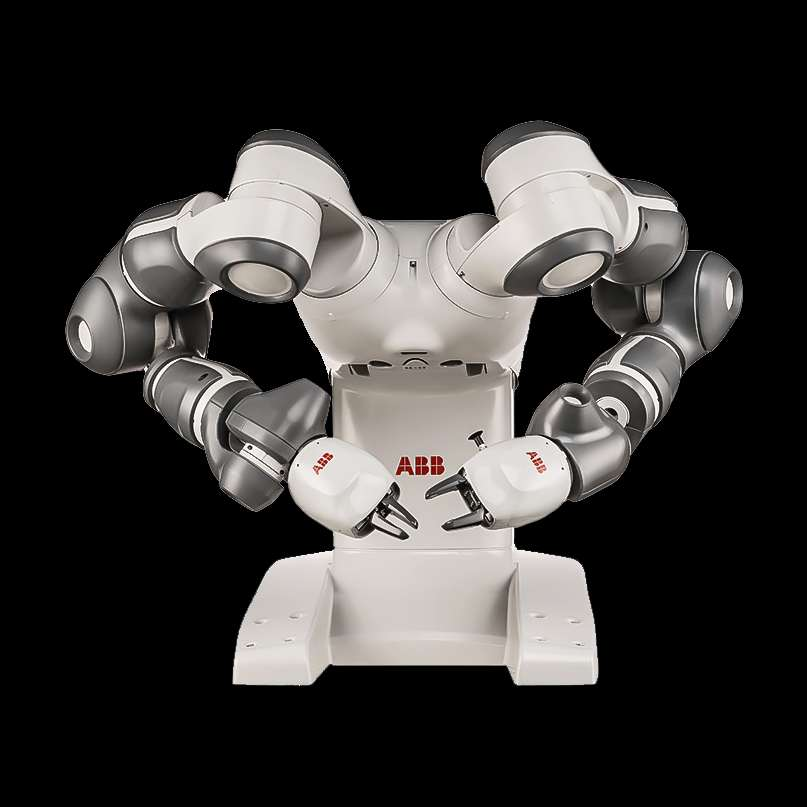
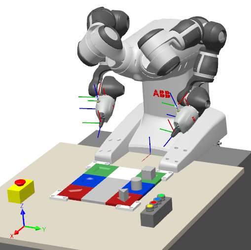
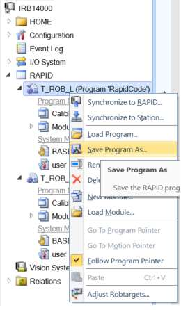
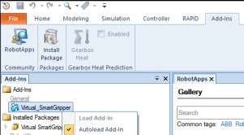
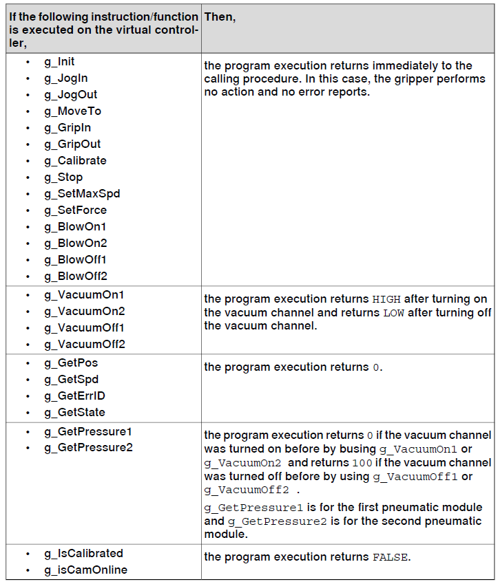

# TEL200_VT26_YuMi_Lab

Source PDF: TEL200_VT26_YuMi_Lab.pdf

## Page 1

VT2025 
Norges miljø- og biovitenskapelige universitet 
Fakultet for REALTEK  
Institutt for maskinteknikk og teknologiledelse 
TEL200 – Introduction to Robotics  
ABB RobotStudio and YuMi 
Project 
Author(s): David A. Anisi, Henrik Nordlie and Mikkel E. Stryker 
Figure 1: YuMi cobot (Photo Courtesy abb.com)

### Images

#### Image 1 (Page 1)

---

## Page 2

ABB RobotStudio and Yumi Project 
 
This robot lab project consists of three parts: 
1. RobotStudio Basics  
2. YuMi Application  
3. YuMi Challenge  
This project will count and constitute 60% of the overall course assessment. 
Documentation and reporting 
• 
The project evaluation will be based on both oral presentation as well as a written report. 
The oral presentation – scheduled for 2026-03-23 - will be 10 minutes, cover Part 1 & 2 and 
include a maximum 3-minute-long video. The written report – due 2026-03-23 - must be 
maximum 10 pages and explain your main ideas as well as implementation details for Part 2 
& 3 of this project. Additionally, you must produce and submit a video (max 3 min) - including 
commentary audio and/or text overlay - showing and explaining your developed YuMi 
Challenge application. The following table provides an overview over the necessary 
documentation and reporting in this project.  
Nb! Achieving top grade requires solving the YuMi Challenge (Part 3). 
Module 
Model 
Type  
Requirement 
Delivered as 
Due 
Grade 
Part 1: RS Basics Sim 
Video 
1 min 
Presentation 
Mar-23 
P/F 
Part 2: YuMi 
Application 
Sim and 
Real 
Video 
1-2 min 
Presentation 
Mar-23 
P/F 
PDF report 
Max 5 pages 
File submission 
Mar-23 
0-60p 
Part 3: YuMi 
Challenge 
Sim/Real Video 
Max 3 min 
File submission 
Mar-23 
0-60p 
PDF report 
Max 5 pages 
File submission 
Mar-23 
0-60p 
 
 
RS Pack&Go 
.rspag file 
File submission 
Mar-23 
0-60p 
 
The following requirements must be followed regarding the submitted report: 
• One report per group. Put the names of all group members on the cover page. 
• The report can be written in English, Norwegian or Swedish   
• Write maximum 10 pages report including all possible appendices and submit 
preferably as one single PDF file. 
• You can choose to either use NMBU Report Template for word or LATEX (e.g. using 
Overleaf) to write the report and generate the PDF file. No other report formats will 
be evaluated. 
• The report’s disposition must be based on IMRaD and should contain the following 
sections: 1) Abstract, 2) Introduction, 3) Method, 4) Results, 5) Discussion, 6) 
Conclusions. See e.g., NMBU Structure of a Science Paper and IMRadD.  
• Include enough details in the report to enable another M.Sc. Robotics student to 
follow your steps and repeat your project.  
• In the report, include as many learning-points and connections as possible with the 
course literature and syllabus. This, to fully manifest what you have learned and 
that you are able to connect your acquired knowledge (theory) and skills (practice). 
This will constitute one of the main evaluation criteria for this project.

---

## Page 3

• Before the final deadline, submit the PDF file plus the YuMi Challenge video and RS 
Pack&Go file. You may submit your video, either uploaded directly as a separate file 
on Canvas, or a link to an external website where you host your video. In the latter 
case, please make sure that we can access the video at any time after your 
submission. No other files or formats will be evaluated. 
• This project is also an exercise in teamwork. Good results are usually achieved by 
groups which organize their work efficiently. You are thus expected to plan your 
project carefully, e.g., using a Gantt chart to highlight the following aspects:  
o How should you distribute the allocated time?  
o Are all team members available during the entire project period?  
o Who is doing what?  
o How often and when will you meet to work on the project?  
o The last week before the deadline (at least 2-3 days) put the focus on the oral 
presentation/report! 
• Evaluation criteria for this project include making clear and technically sound 
simulations in RobotStudio, submitting a video of the real robot running the script 
developed for the YuMi Application and producing a well-structured, well-written 
and concise report that extensively connects the skills gained during this project 
with the acquired knowledge (theory) in the course syllabus. 
• Nb! Achieving top grade requires solving the YuMi Challenge (Part 3). 
Part 1: RobotStudio Basics 
In this part of the lab, you are expected to get acquainted and learn the basic functionalities and 
capabilities of RobotStudio with a particular focus on offline programming and simulation. This is 
based primarily on RobotStudio Tutorial Video Library from the distant course in Industrial Robotics 
at Högskolan i Skövde (HiS), as well as  official ABB material such as ABB RobotStudio Tutorial Videos, 
ABB RobotStudio Operating Manual and RAPID Technical reference manual (see also TEL200 Canvas 
page under Misc/RobotStudio). 
1. Watch, learn and practice the introductory 33 min video from HiS.  
2. Go through the 5 ABB RobotStudio Tutorial Videos and “get started in 30 minutes”. Make 
sure you know how to and have practiced the following skills:  
a. Opening/saving a solution. 
b. Importing (YuMi) robot from ABB Library. 
c. Navigating in 3D window (Zoom, pan, rotate). See also 2 min video from HiS. 
d. Jogging the robot. See also 14 min video from HiS for more details. 
e. Importing tools from Library (use ABB Smart Gripper for YuMi). 
f. Creating, modifying, and moving along paths.  
g. Importing and positioning of (CAD) geometries1.  
h. Creating and modifying WorkObjects and Targets.  
i. 
Setting robot Configuration. 
j. 
Creating main Path, Insert Procedure Call and Synchronize to RAPID. 
k. Generating, showing, and modifying RAPID code.  
l. 
Play and Record Simulation. See also 9 min video from HiS. 
Documentation and reporting: Please document your work by producing a short (1 min) video 
showing your simulation and skills learned. This will be presented as part of the oral presentation. 
 
1 If needed, use SolidWorks/AutoCad to convert to the .sat format that is natively used by RobotStudio.

---

## Page 4

Part 2: YuMi Application 
 
In this part of the project, you are expected to develop a robot program for the YuMi robot which 
enables it to manipulate objects. In addition to the basic knowledge and skills acquired in Part 1 of 
this project, you will continue exploring more advanced functionalities of RobotStudio including 
importing or creating Geometries, Mechanisms and Smart Components that are able to both 
manipulate and be affected by the objects around it.  
To this end, follow these steps and instructions: 
1. Download from Canvas and Unpack&Go the TEL200-YuMi-Lab.rspag file.  
2. This station contains  
a. ABB YuMi IRB400 robot, holding two Virtual SmartGripper tools  
b. E-Stop button  
c. Plate with three movable geometric objects (cube, cylinder and triangular prism) 
d. Switch with four colored buttons  
Here, the green, blue and red buttons will be used to initiate movement of the cube, 
cylinder and triangular prism respectively, while the yellow button should move the 
robot back to its “home” position. Finally, the E-Stop button will be used to stop/halt the 
robot at any time during motion. 
 
  
  
3. This requires introduction of five Digital Input (DI) signals. To standardize and decrease the 
time needed for running your code on the real robot, define and use the following Digital 
Input (DI) signals in your RAPID code and solution

### Images

#### Image 1 (Page 4)

---

## Page 5

• 
di_cube: connected to the green-colored switch, should have value 1 when the 
robot should move the cube from initial position (A) to position B and value 0 
otherwise. 
• 
di_cylinder: connected to the blue-colored switch, should have value 1 when the 
robot should move the cylinder from initial position (A) to position B and value 0 
otherwise. 
• 
di_prism: connected to the red -colored switch, should have value 1 when the robot 
should move the triangular prism from initial position (A) to position B and value 0 
otherwise. 
• 
di_EmergencySituation: which is “normally closed” and should have value 0 when 
the E-stop button is pressed down (and the robot should hence stop/halt), and value 
1 when the E-stop button is set back to neutral position and can hence continue its 
$$
movement.  You can set "Invert Physical Value" = Yes in I/O Config/engineering.
$$
• 
di_home: connected to the yellow-colored switch, should move the robot back to its 
“home” position and value 0 otherwise. 
4. The E-Stop button in RobotStudio consists of a “base” and “button” component. Use “Create 
Mechanism” to model the E-Stop button moving up/down using these base and button 
components as links. 
5. In RobotStudio, create a “Smart Component” able to manipulate this E-Stop Mechanism by 
defining necessary signals and components.  
6. In addition, create another «Smart Component” representing the E-Stop button, consisting of 
the base and button components with the functionality to move the button up/down upon 
the toggling of the given DI signal, namely di_EmergencySituation. Browse through the 
available Components for building a “Smart Component” to find an appropriate way of 
manipulating the button object in the simulation. This is an alternative way of obtaining the 
same objective as Steps 5-6. 
7. Now, proceeding with only one of the E-Stop Smart Components above (hide the other one), 
define the necessary WorkObjects, Targets and Paths for the robot to be able to move the 
geometric objects (cube, cylinder and triangular prism) from their starting positions (A) to 
the associated storage slot (B). These movements must be initiated by the Digital Input (DI) 
signals defined earlier and should be able to be toggled via Station Logic (during Simulation). 
In real world however, these signals will naturally be triggered using the four-button switch. 
8. Makes sure that di_EmergencySituation and di_home work as intended. 
9. Synchronize to the Virtual Controller and test your application in Simulation.  
10. From the Controller tab, start the Virtual FlexPendant, go to 
$$
Production Window, choose "PP to Main" (PP = Program Pointer)
$$
and step through your code in order to verify that everything runs 
as intended. 
11. After showing your simulation to us and getting it approved, go to 
Controller tap and save your program(s) by right-clicking on them 
(see screenshot) before down-loading and running it on the real 
Yumi robot in the lab. If using both arms (Left and Right), please 
make sure to save and download both programs. 
12. Don’t forget to document your simulated/real runs.

### Images

#### Image 1 (Page 5)

---

## Page 6

Practical tips and considerations: 
• 
The Virtual SmartGripper fully emulates the effects from all signals to the real 
SmartGripper on the physical YuMi robot. Hence you can manipulate the SmartGripper 
both “manually” from RobotStudio but also via the (virtual) FlexPendant as well as via 
RAPID code. For a list of RAPID commands, please see Table 1 and Sec-. 5.1 of 
“3HAC054949-001 Product manual Smart Gripper” in Canvas (Files-> Misc -> RobotStudio) 
• 
Virtual SmartGripper requires an add-in in RobotStudio. The version used in TEL200 
(2.03.01) has been installed by IT-departmet on all lab-PCs. You must however make sure 
that it is loaded when using RobotStudio. To achieve this, go to “Add.Ins” tab, right click 
on “Virtual_SmartGripper” add-in and select “Load Add-in”. Activate also “Autoload Add-
in” to automatically load it in next time you start RobotStudio (see picture) 
• 
If running RobotStudio on your own PC, you have to first download and install the 
correct version “Virtual_SmartGripper-2.03.01” which can be found in Canvas (Files-> 
Misc -> RobotStudio) 
 
 
• 
The E-stop button has a stroke-length (height difference between pushed-down and 
neutral position) of 10 mm. 
• 
Consider using the MotionSup instruction in RAPID to adjust the sensitivity of the Motion 
Supervision functionality of the robot to avoid collision detection when manipulating 
objects with “high” forces.  
• 
Reachability and feasibility of targets can be a real pain-point. To be able to address this, 
study how “robot axis configurations” are represented and chosen in RobotStudio and 
learn the difference between the main move instructions (e.g., MoveJ, MoveL, 
MoveAbsJ, MoveC). Begin your paths using joint-based movements.  
• 
Carefully choose and use the different options used in the move instructions, especially 
regarding speeddata (default v1000) and zonedata (default z100) which defines the 
speed and accuracy of the movement when approaching and reaching next position. 
• 
To avoid too many problems when moving through singularities2 in Cartesian coordinates 
(e.g. using MoveL), consider adding an Action Instruction and enable “SingArea Wrist” 
by choosing it as Instruction Template. 
• 
When manipulating objects in the real world, it is good practice to approach the target 
from a simpler and free/clear direction; typically, directly from above. This is most 
conveniently achieved by copying and modifying/offsetting the position of your 
manipulation target by some distance. 
• 
Finally, one may introduce some WaitTime (Action Instruction -> Instruction Templates) 
between critical movements to let the physical, manipulated parts settle. 
 
2 Watch this video regarding possible singularities for ABB Yumi arm. We will cover the theory and reasons 
behind singularities and its relation to manipulability and the (determinant or condition number of the) 
Jacobian matrix in lectures, so don’t worry too much about it now.

### Images

#### Image 1 (Page 6)

---

## Page 7

Documentation and reporting: In this part, you are expected to  
1. Produce a short (2-3 min) video showing your simulation and skills learned. Present it during 
the oral examination. 
2. Explain your line of thought and implementation details in the written report  
3. Make sure to connect the skills gained during this project with the acquired knowledge 
(theory) in the course syllabus. 
 
Table 1: RAPID  code for controlling SmartGripper on an virtual controller

### Images

#### Image 1 (Page 7)

---

## Page 8

Part 3: YuMi Challenge 
 
ABB YuMi, the legendary two-arm cobot, was the first of its kind, revolutionizing the way humans 
and robots collaborate. Ever since launched in 2015, roboticists around the world have uploaded 
numerous videos showing the possibilities of YuMi as an inspiration for others. 
In this part of the project lab, we will let this inspiration continue to flow with the “YuMi Challenge” 
where you are expected to develop your own fancy application. For some initial inspiration, please 
watch the below listed videos:  
• 
“Celebrating 5 years of YuMi” (from 2020)  
• 
YuMi making paper-airplanes  
• 
YuMi Robot Café  
• 
YuMi at the Opera  
• 
YuMi solving Rubrik’s cube  
• 
YuMi assembling Lego  
Also, please consider exploring and developing the VR/AR capabilities of ABB Robotstudio in 
combination with Meta Quest pro (which you may borrow for HW demo) 
• 
VR ABB SolarCell with Meta Quest 
• 
VR robot programming with HTC Vive 
• 
Robot programming using VR  
Please bear in mind that creativity and originality is strongly advocated and will be part of the 
evaluation criteria in this part of the project. 
Documentation and reporting: In this part, you are expected to  
1. Produce a video (max 3 min) - including an audio and/or text overlay - showing and 
explaining your fancy application. Submit it via Canvas.   
2. Explain your line of thought and implementation details in a written report. 
3. Make sure to connect the skills gained during this project with the acquired knowledge 
(theory) in the course syllabus. 
4. Upload the Pack&Go file (.rspag) to Canvas.

---
